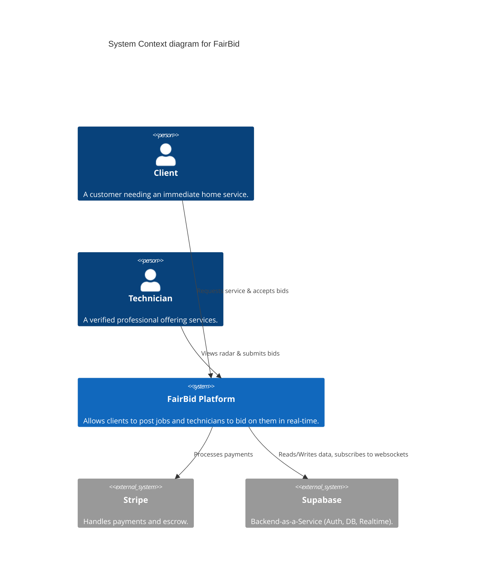
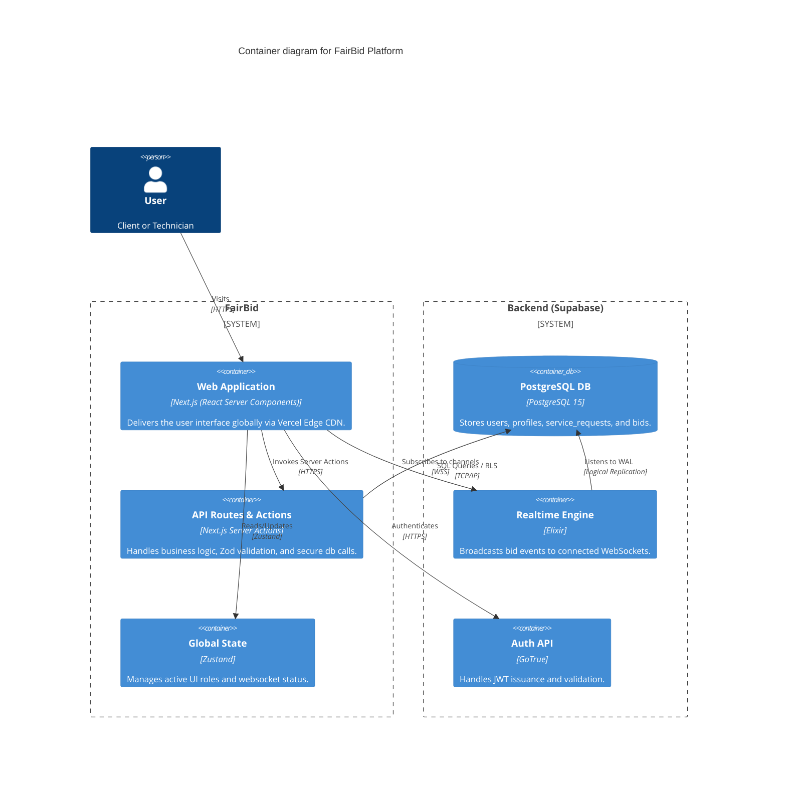

# FairBid (former Cartagena Concierge) - System Architecture

This document describes the high-level C4 Model architecture for the FairBid platform, utilizing Next.js, Supabase, and a Realtime Bidding Engine.

## Level 1: System Context

## Level 2: Container Diagram

## Technical Decisions

- **Strict TypeScript**: `noImplicitAny` and `strict` modes enforced to prevent runtime type errors.
- **Zod Validation**: All API inputs and database writes are validated generically via `src/lib/validations.ts`.
- **Error Boundaries**: Root and granular boundaries ensure localized failures do not crash the React tree.
- **State Management**: `Zustand` limits React Context re-renders for core UI toggles.
